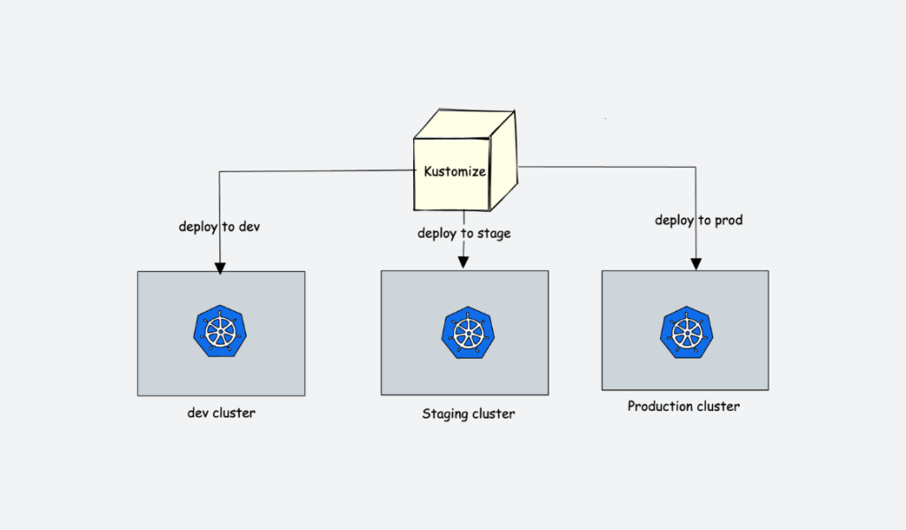
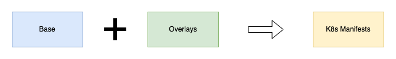

# 01 - Kustomize Introduction

## What is kustomize?
---

Kustomize is an open-source configuration management tool for Kubernetes.

It allows you to define and manage Kubernetes objects such as deployments, Daemonsets, services, configMaps, etc for multiple environments in a declarative manner without modifying the original YAML files. To put it simply, you have a single source of truth for YAMLs, and you patch required configurations on top of the base YAMLs as per the environment requirements.



## Main Features
The following are the main features of Kustomize

- Helps customizing config files in a template free way.
- Provides a number of handy methods like generators to make customization easier.
- Uses patches to introduce environment specific changes on an already existing standard config file without disturbing it.

## Main Concepts
---

Under Kustomize topic there are three main concepts:

- `Base Files` - Common Yamls used across all environments
- `Overlay` - Patches specifications for each those environments
- `Transformers` - Transforms one config into another, allowing to transforming the base files


### Base Files

The Base files represents the configuration that will be shared across all our environments, so that's why it is called base. The composition between `Base Files` + `Overlays` will result in our `K8s Manifests`



### Overlays

The Overlay is the customized value of an specific environment, so it helps to introduce environment-specific changes on existing Base kubernetes configuration files without modifying them.

When patching there three parameters that we always should provide

1. `Operation Type` - add, remove or replace
2. `Target` - Resource name to modify
3. `Value` - Value name to will be added or replaced. If the operation type is `remove` there would be no value

Also, there are two types of overlay(patches)

1. `JSON 6902` - Requiring to provide the **target** and the patch **details**
    ```yaml 
    patches:
  - target:
      kind: Deployment
      name: nginx
    patch: |-
      - op: replace
        path: /spec/replicas
        value: 3
    ```

2. `Stragetic Merge` - Similar to standard k8s config, the result will be the base manifest with the configuration that we would like to change
    ```yaml
    patches:
  - patch: |-
      apiVersion: apps/v1
      kind: Deployment
      metadata:
        name: nginx
      spec:
        replicas: 3
    ```

### Transformers

Transformers in Kustomize modify Kubernetes resource configurations by applying systematic changes, such as injecting labels, annotations, or altering specific fields in the YAML manifests

Kustomize has several built-in transformers such as:

- `LabelTransformer` - Adds labels to resources.
- `AnnotationsTransformer` - Adds annotations to resources.
- `NamespaceTransformer` - Changes the namespace of resources.
- `NamePrefixTransformer` - Adds a prefix to resource names.
- `PatchTransformer` - Applies strategic merge or JSON patches to resources.

For a full list look at [here](https://kubectl.docs.kubernetes.io/references/kustomize/builtins/)