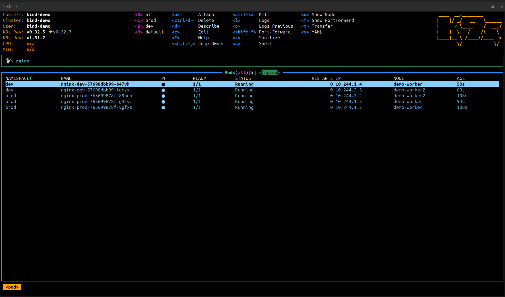

# Kustomize Studies

This repository aims to keep track of my kustomizes studies and POCs, in order of to be an easy way to refresh my knowledges

## Requisites
---

1. [Install Docker](https://docs.docker.com/engine/install/ubuntu/)
2. [Install Kind](https://kind.sigs.k8s.io/docs/user/quick-start)
3. [Install Kubectl](https://kubernetes.io/docs/tasks/tools/install-kubectl-linux/)

## Introduction
---
For a quick explanation about Kustomize check this [link](./01-Introduction.md)

## Setup
---

These are the steps required in order to following this guide

1. Create a local Kubernetes Cluster with Kind
```bash
kind create cluster --name demo --config ./artifacts/kind/multi-node.yml
```

2. Configure Kubectl to reference the recently craeted Kind Cluster
```bash
kubectl config use-context kind-demo
```

3. Check if everything is okay
```bash
kubectl cluster-info
```

## Running
---

This project deploys two nginx applications simulating the `development` and `production` environments. Each environment uses a specific configuration such as image, namespace, and deployment stategy

In order to deploy the application run the following steps:

1. Create the required namespaces
```bash
kubectl create namespace dev
kubectl create namespace prod
```

2. Deploy the application using kustomize
```
kubectl apply -k ./artifacts/kustomize/overlays/dev
kubectl apply -k ./artifacts/kustomize/overlays/prod
```

## Results
---



## References
---

- [Kustomize Tutorial](https://devopscube.com/kustomize-tutorial/)
- [Kustomize Documentation](https://kubectl.docs.kubernetes.io/guides/)